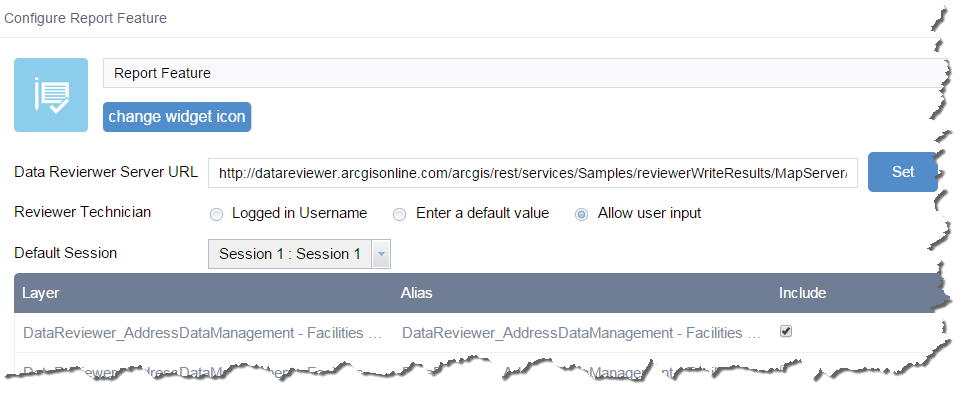
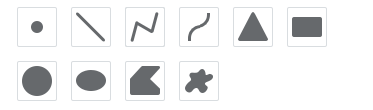

# Report Feature widget
The Report Feature widget for Web AppBuilder works with the ArcGIS Data Reviewer for Server extension.

The Report Feature widget enables you to collect and manage data quality feedback from users of your web application. Users can report existing features from the map that are in error or require additional review. They can also identify missing features by sketching them on the map. Feedback is stored in your geodatabase as a Reviewer Result where it is assessed and managed through a defined life cycle workflow.

## Sections

* [Features](#features)
* [Requirements](#requirements)
* [Instructions](#instructions)
* [Configuring the Report Feature widget][]
* [Using the Reviewer Dashboard widget][]
* [Resources](#resources)
* [Issues](#issues)
* [Contributing](#contributing)
* [Licensing](#licensing)

## Features
* Report existing features from the map that are in error or require additional review
* Report missing features by interactively drawing them on the map

## Requirements
Requires Web AppBuilder for ArcGIS version 1.2

## Instructions
Deploying Widgets

To use the widgets with you should copy any of the widgets to the stemapp/widget directory. This is located in %webappbuilder_install%/client directory.

For more resources on developing modifying widgets please visit
[Web AppBuilder for ArcGIS Documentation](http://doc.arcgis.com/en/web-appbuilder/)

##Configuring the Report Feature widget

Use Web AppBuilder for ArcGIS to configure the Reviewer Dashboard Widget.

1.	Click the pen in the bottom-right corner of the Report Feature icon to begin a configuration session.
2.	To change the Report Feature icon, click the **change widget icon* button and replace it with your own image. A file explorer window opens, allowing you to select a local image file to use as the widget icon.
3.	Provide the **Data Reviewer for Server URL**, then click **Set**.
The associated sessions in this new URL map service will populate the Default Session drop-down list.
4.	Select how the Reviewer Technician attribute of a result is populated. Options for populating this attribute include: 
  1.	**Logged in Username**—the active portal username will populate the attribute.
  2.	**Enter a default value**—a pre-defined value will populate the attribute.
  3.	**Allow user input**—the user provides a value during submission.
5.	Select the Reviewer Session to use as your default session from the drop-down list, then click **OK**.

**Note:** The Reviewer result will immediately save to the session you selected as your Default Session.

##Using the Report Feature widget
###**Select Tab**   
Choose features from a selected map layer to report as an error.
1.	Select a map layer from the drop-down menu.
2.	Zoom in and click to select a feature to report. The **Details** dialog box opens.
3.	Select the **Review Status** from one of the following:
  1.	Add Feature
  2.	Delete Feature
  3.	Move Feature
  4.	Reshape Feature
4.	Write **Notes**, if any, on the issue.
5.	Select the **Severity** level of the non-conforming issue with this feature with “1” being the most severe and “5” being the least severe
6.	In the **Reported By** field, type a name for the person who is reporting this issue.   
**Note:** In some deployments, the **Reported By** field will not display.
7.	Click **Report**.
A Report received notification appears indicating that the feedback has been received&mdashclick **OK**. 

###**Draw Tab**   
Select a layer to report a missing feature by drawing it in the map. 
1.	Select a geometry type from the Draw toolbar options.

2.	Go to the exact location on the map where you want to report your feature, and draw. The **Details** dialog box opens.
3.	Select the **Review Status** from one of the following:
  1.	Add Feature
  2.	Delete Feature
  3.	Move Feature
  4.	Reshape Feature
4.	Write **Notes**, if any, on this issue.
5.	Select the **Severity** level of the non-conforming issue with this feature with “1” being the most severe and “5” being the least severe.
6.	In the **Reported By** field, type a name for the person who is reporting this issue.   
**Note:** In some deployments, the **Reported By** field will not display.
7.	Click **Report**.

A Report received notification appears indicating that the feedback has been received&emdashclick **OK**. 

## Resources

## Issues
* Find a bug or want to request a new feature?  Please let us know by submitting an issue.

## Contributing
Esri welcomes contributions from anyone and everyone. Please see our [guidelines for contributing](https://github.com/esri/contributing).

## Licensing
Copyright 2015 Esri

Licensed under the Apache License, Version 2.0 (the "License");
you may not use this file except in compliance with the License.
You may obtain a copy of the License at

   http://www.apache.org/licenses/LICENSE-2.0

Unless required by applicable law or agreed to in writing, software
distributed under the License is distributed on an "AS IS" BASIS,
WITHOUT WARRANTIES OR CONDITIONS OF ANY KIND, either express or implied.
See the License for the specific language governing permissions and
limitations under the License.

A copy of the license is available in the repository's
[license.txt](../LICENSE) file.

